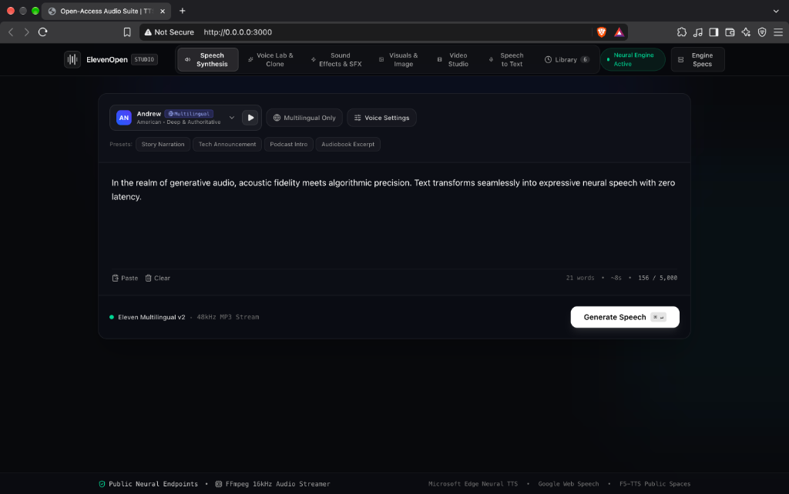

# ElevenOpen Studio

A web app for text-to-speech, speech-to-text, voice matching and cloning, sound effects, images and short videos. It uses free public services and local audio processing, so no paid API keys are needed.



## Features and what runs behind them

Some features have a local fallback for when a free public service is busy or offline. The UI says when a fallback produced a result.

| Feature | Normal path | Fallback |
|---|---|---|
| Speech synthesis | Microsoft Edge voices through [edge-tts](https://github.com/rany2/edge-tts). Needs internet. | None |
| Speech to text | Google Web Speech through SpeechRecognition. Needs internet. | None |
| Voice analysis | Local pitch (F0) and spectral centroid measurement with NumPy and SciPy | None |
| Voice cloning | [F5-TTS](https://huggingface.co/spaces/mrfakename/E2-F5-TTS) Space, only if you enter a Hugging Face token | Voice match: the closest stock Edge voice with pitch and EQ changes. This is not a clone, and the UI says so. |
| Sound effects | AudioLDM2 Space, only if you enter a token | Built-in synthesizer that reacts to a few keywords (knock, punch, footsteps, laser, rain). It is not a neural model. |
| Ambient sound | Stable Audio Open Space, only if you enter a token | Same built-in synthesizer |
| Images | [Pollinations](https://pollinations.ai/). Needs internet. | None |
| Video | AnimateDiff-Lightning Space. It returns about 1.6 seconds of motion, which is looped and upscaled with FFmpeg. Other Spaces are tried if you enter a token. | A cross-dissolve between two generated images, labelled as not AI-generated motion |

Free Spaces have rate limits and are sometimes asleep, so expect slow first requests and occasional fallbacks.

## How it is built

```
Browser (React, Vite, Tailwind)
  |  fetch /api/*
  v
Express server (server.ts, server/)
  |  one Python process per job, JSON on stdout
  v
audio_engine.py (NumPy, SciPy, FFmpeg, edge-tts, gradio_client)
  |
  +-- Edge TTS, Google Web Speech, Hugging Face Spaces, Pollinations
```

- `src/`: the React frontend. Each tab is loaded separately. History is stored in IndexedDB.
- `server.ts` and `server/`: the Express API. It validates inputs, rate limits requests, limits how many jobs run at once, stops jobs that run too long, and deletes temporary files after each request.
- `audio_engine.py`: takes an action and a JSON payload on the command line and prints one JSON object. It can also run as an HTTP API (see below).

## Setup

You need Node.js 18 or newer, Python 3.10 or newer, and FFmpeg on your PATH.

```bash
pip install -r requirements.txt   # use a virtual environment if you like
npm install
cp .env.example .env              # optional
npm run dev
```

Open http://127.0.0.1:3000. The badge in the header shows whether the engine is ready. If it says "Setup Needed", hover over it or check the server console to see what is missing (FFmpeg or a Python package).

To build and run for production:

```bash
npm run build
npm start
```

## Configuration

All settings are optional. See `.env.example`.

| Variable | Default | Meaning |
|---|---|---|
| `HOST` | `127.0.0.1` | Address to listen on |
| `PORT` | `3000` | Port to listen on |
| `HF_TOKEN` | none | Hugging Face token to use when the UI does not send one |
| `PYTHON` | `python3` (`python` on Windows) | Python interpreter for the engine |
| `MAX_CONCURRENT_JOBS` | `2` | Engine processes that can run at once. Others wait in a queue. |
| `RATE_LIMIT_PER_MINUTE` | `30` | POST requests to `/api/*` per client IP per minute |
| `ENGINE_TIMEOUT_MS` | `300000` | A job is stopped after this many milliseconds |
| `MAX_BODY_MB` | `50` | Maximum upload and request body size |

## Security

This is meant to run on your own machine. It is not a multi-user service.

- It listens on `127.0.0.1` by default. The API has no login, and each request can run FFmpeg or call remote GPU Spaces. If you set `HOST=0.0.0.0`, put it behind a reverse proxy that requires authentication.
- A Hugging Face token entered in the UI goes to your server and then to Hugging Face. The Video tab also saves it in your browser's `localStorage`. Use a read-only token.
- The server checks and limits all inputs. Temporary files are readable only by the owner and are always deleted.

## Running the engine as an HTTP service

The web app calls the engine from the command line. To run it as a separate HTTP service instead:

```bash
uvicorn audio_engine:app --port 8000
```

This serves `POST /api/sfx`, `/api/ambient`, `/api/image` and `/api/video`.

## Tests

```bash
npm run lint       # TypeScript type check
npm test           # server tests, no Python needed
pip install -r requirements-dev.txt
npm run test:py    # engine tests, no internet needed
```

CI runs these and a production build on every push and pull request.

## Limitations

- Speech synthesis and speech to text need internet access. There is no offline speech model.
- Voice match picks from a few stock voices, so it will not sound like the reference speaker. Real cloning needs the F5-TTS Space and a token.
- The built-in sound effect synthesizer only understands a small set of keywords.
- Videos are 2 to 10 seconds long, and only about 1.6 seconds of that is generated motion, which is then looped.

## License

MIT. See `LICENSE`.
